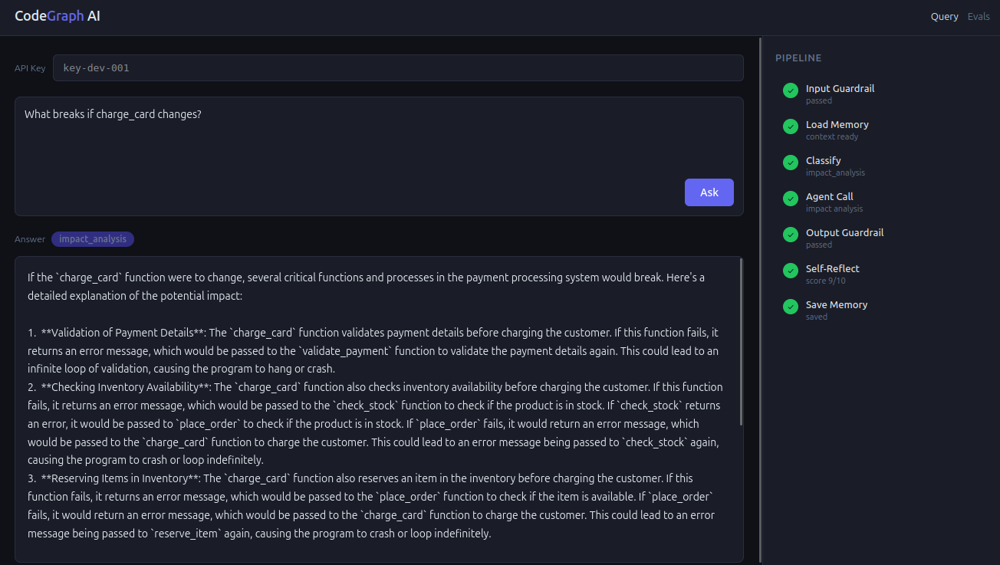
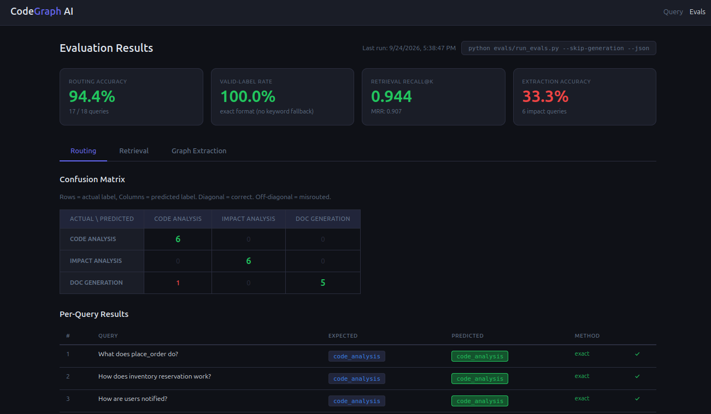
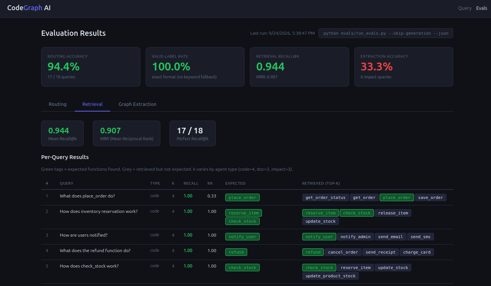
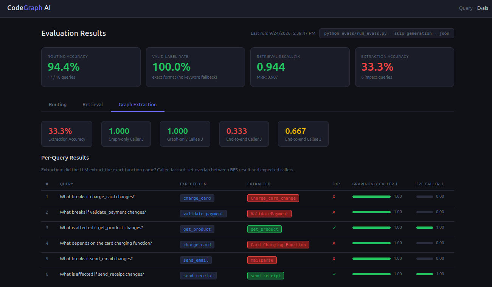

# CodeGraph AI

A multi-agent AI system that analyzes codebases using Graph RAG — combining semantic vector search with knowledge graph traversal to answer questions about code, trace dependencies, and generate documentation.

Built entirely on open-source tools. No paid APIs.

---

## What It Does

- **Code Analysis** — Ask what a function does; answers using semantic search over the codebase
- **Impact Analysis** — Ask what breaks if a function changes; traces callers and dependencies through a knowledge graph
- **Doc Generation** — Generate markdown documentation for any function or module

---

## Tech Stack

| Layer | Technology |
|---|---|
| LLM inference | Ollama (`llama3.2:3b` for classification, `llama3.2:1b` for generation) — runs locally |
| Embeddings | Ollama (`nomic-embed-text`) |
| Vector store | ChromaDB — persistent, cosine similarity |
| Knowledge graph | NetworkX — directed graph, BFS traversal |
| Agent framework | LangGraph — StateGraph with self-reflection loop |
| Agent protocol | A2A — Agent Cards + task lifecycle over HTTP |
| API framework | FastAPI + Pydantic |
| Memory | Session buffer (in-process) + ChromaDB long-term (TTL 30 days) |

---

## Architecture

```
User Request
    → Orchestrator (port 8000)
        → Input Guardrail
        → Load Memory (session + long-term)
        → Classify Query (LLM)
        → Call Agent (A2A protocol)
              ├── Code Analyst    (port 8001) — ChromaDB semantic search
              ├── Impact Analyzer (port 8002) — NetworkX graph traversal
              └── Doc Generator   (port 8003) — ChromaDB + markdown output
        → Output Guardrail
        → Self-Reflection (LLM scores answer, retries if score < 6)
        → Save Memory
    → Response
```

---

## Project Structure

```
codegraph-ai/
├── core/                   # Shared modules
│   ├── models.py           # Pydantic models
│   ├── ollama_client.py    # LLM + embedding client
│   ├── vectorstore.py      # ChromaDB wrapper
│   ├── graph_store.py      # NetworkX knowledge graph
│   ├── memory.py           # Session + long-term memory
│   ├── guardrails.py       # Input/output validation
│   └── auth.py             # API key authentication
├── orchestrator/
│   ├── main.py             # FastAPI app — /query and /query/stream
│   ├── graph.py            # LangGraph StateGraph
│   └── agent_client.py     # A2A HTTP client
├── agents/
│   ├── code_analyst/       # Semantic code search agent
│   ├── impact_analyzer/    # Graph traversal agent
│   └── doc_generator/      # Documentation agent
├── ingest/
│   ├── parser.py           # AST parser — extracts functions, classes, call relationships
│   └── embedder.py         # Embeds chunks → ChromaDB + builds graph
├── evals/                  # Eval suite (routing, retrieval, graph, generation)
├── frontend/               # Browser UI (query + streaming pipeline panel + eval dashboard)
├── assets/                 # Screenshots
├── sample_code/            # Demo e-commerce codebase (orders, payments, inventory...)
├── Makefile
├── Dockerfile
├── docker-compose.yml
└── requirements.txt
```

---

## Setup

### Prerequisites

- Python 3.10+
- [Ollama](https://ollama.com) installed and running

### 1. Pull models

```bash
ollama pull llama3.2:3b
ollama pull llama3.2:1b
ollama pull nomic-embed-text
```

### 2. Install dependencies

```bash
pip install -r requirements.txt
```

### 3. Ingest the codebase (run once)

```bash
make ingest
```

This parses `sample_code/`, embeds all functions and classes into ChromaDB, and builds the knowledge graph.

---

## Running

### One command (recommended)

```bash
make start    # starts all 3 agents in background + orchestrator in foreground
make stop     # stops all services
```

### Or separately (4 terminals)

```bash
make analyst       # Terminal 1 — port 8001
make impact        # Terminal 2 — port 8002
make docs          # Terminal 3 — port 8003
make orchestrator  # Terminal 4 — port 8000
```

### UI

Open `http://localhost:8000/ui` in a browser — query box with streaming pipeline panel.

### Run evals

```bash
make evals    # routing + retrieval + graph extraction eval suite
```

### Docker

```bash
docker compose up --build

# First time only — pull models and run ingest
docker compose exec ollama ollama pull llama3.2:3b
docker compose exec ollama ollama pull llama3.2:1b
docker compose exec ollama ollama pull nomic-embed-text
docker compose run --rm code_analyst python ingest/embedder.py sample_code/
```

> Model pull and ingest are required before agents return real answers.

---

## Usage

### Standard query

```bash
curl -X POST http://localhost:8000/query \
  -H "Content-Type: application/json" \
  -H "X-API-Key: key-dev-001" \
  -d '{"query": "what does place_order do?"}'
```

### Impact analysis

```bash
curl -X POST http://localhost:8000/query \
  -H "Content-Type: application/json" \
  -H "X-API-Key: key-dev-001" \
  -d '{"query": "what breaks if charge_card changes?"}'
```

### Generate documentation

```bash
curl -X POST http://localhost:8000/query \
  -H "Content-Type: application/json" \
  -H "X-API-Key: key-dev-001" \
  -d '{"query": "generate documentation for the refund function"}'
```

### Streaming (SSE)

```bash
curl -X POST http://localhost:8000/query/stream \
  -H "Content-Type: application/json" \
  -H "X-API-Key: key-dev-001" \
  -d '{"query": "how does inventory reservation work?"}'
```

### API keys

| Key | Permissions |
|---|---|
| `key-dev-001` | code analysis, impact analysis, doc generation |
| `key-readonly-001` | code analysis only |

---

## Eval Results

4-level eval suite run against 18 hand-labeled queries on the sample codebase:

| Eval Level | Metric | Score |
|---|---|---|
| Routing | Accuracy (correct agent selected) | **94.4%** (17/18) |
| Routing | Valid-label rate (clean format, no keyword fallback) | **100%** (18/18) |
| Retrieval | Recall@k (expected function in top-k results) | **94.4%** |
| Retrieval | MRR (average reciprocal rank of the first correct result) | **0.907** |
| Graph Extraction | Extraction accuracy (correct function name extracted) | 33.3% |
| Graph Extraction | Graph-only caller Jaccard (tests AST + graph + BFS) | **1.000** |
| Graph Extraction | End-to-end caller Jaccard (tests full pipeline) | 0.333 |
| Graph Extraction | End-to-end callee Jaccard (tests full pipeline) | 0.333 |

Routing uses `llama3.2:3b` for classification and `llama3.2:1b` for generation. The graph itself is perfect (1.000 Jaccard) — the weak point is LLM extraction of exact function names from natural-language queries.

Generation eval (LLM-as-judge on answer quality) is implemented but not yet reported — requires all 4 services running. Run with `python evals/run_evals.py --json`.

### Query UI



### Eval Dashboard — Routing (94.4%)



### Eval Dashboard — Retrieval Tab



### Eval Dashboard — Graph Extraction Tab



---

## Key Concepts

**Graph RAG** — retrieval combines two sources: ChromaDB (semantic similarity) and NetworkX (structural call relationships). Impact analysis uses both — graph for caller/callee chains, vector store as fallback.

**Self-reflection loop** — after every agent response, a second LLM call scores the answer 1–10. If score < 6, the query is enriched with feedback and the agent is called again (max 2 retries).

**A2A Protocol** — each agent exposes a standard interface: `GET /.well-known/agent.json` (capabilities) and `POST /tasks` (task execution). The orchestrator discovers and calls agents through this contract.

**Memory** — two layers: in-process session buffer (last 5 turns, lost on restart) and ChromaDB long-term store (TTL 30 days, auto-cleanup on every save).

**Guardrails** — input validation (length, empty check) and output validation (minimum length, sources required) wrap every request without any external library.
